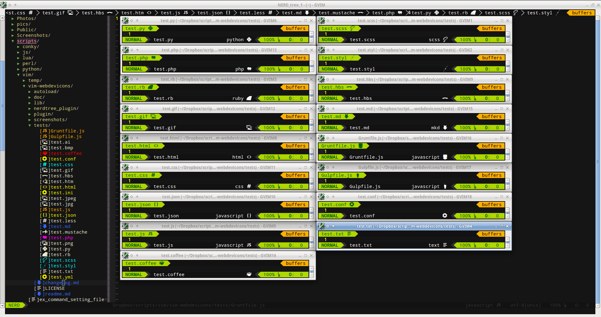
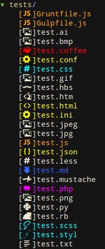
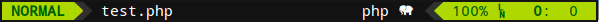
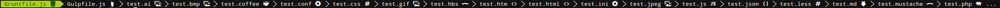

vim-webdevicons
=================

Adds filetype glyphs (icons) to other vim plugins such as nerdtree and vim-airline

## Usage

After installing the patched font and setting the vim font just open nerdtree or look at vim-airline (statusline or tabline)
  * _NOTE:_ if you don't have a vim font set and not running gvim you will need to set the terminal font


## Installing the font

Run the `install_font.sh` script. The script support currently only Linux machines.


## Configuration

Works without Configuration *ONLY* when used with the patched font provided (see lib folder), install font and add to your vimrc or gvimrc, e.g.:

 ```vim
 set guifont=Droid\ Sans\ Mono\ for\ Powerline\ Plus\ Nerd\ File\ Types\ 11
 ```

* additional fonts coming soon
* font patching coming soon

## Screenshots



* NERDTree:



* vim-airline
 * statusline
   
 * tabline
  

## Features
* show developer file type glyphs from a font in various vim plugins, currently supports:
  * [NERDTree](https://github.com/scrooloose/nerdtree)
  * [vim-airline](https://github.com/bling/vim-airline) (statusline and tabline)
* Adds a global config map of characters to file extensions (or entire filenames)
* customizable and extendable filetype detections
  * ability to override predefined dictionary variable
  * if you are unhappy with the default glpyh used you can choose your own
* supports a range of file type extensions by default:
  * styl, scss, htm, html, css, less, md, json, js, rb, php, py , coffee ,mustache, hbs, conf, ini, yml, jpg, jpeg, bmp, png, gif, ai

## Configuration

* by default you should not *NEED* to configure anything to get the basics working
  * _NOTE:_ For the time being you do *NEED* the patched font provided _unless_ you want to configure the filetype to glyph mappings yourself for your current font
* these options can be defined in your vimrc or gvimrc
* the following options are provided however for overriding

* enable/disable loading the plugin (default 1)

 >	let g:webdevicons_enable = 1

* enable/disable adding the flags to NERDTree (default 1)

 >	let g:webdevicons_enable_nerdtree = 1

* enable/disable adding to vim-airline's tabline (default 1)

 >	let g:webdevicons_enable_airline_tabline = 1

* enable/disable adding to vim-airline's statusline (default 1)

 >	let g:webdevicons_enable_airline_statusline = 1

* turn on/off file node glpyh decorations (not particularly useful)

 >	let g:WebDevIconsUnicodeDecorateFileNodes = 1

### character mappings

* change the default character when no match found

 >	let g:WebDevIconsUnicodeDecorateFileNodesDefaultSymbol = 'x'

* change the default dictionary mappings for file extension matches

 >	let g:WebDevIconsUnicodeDecorateFileNodesExtensionSymbols = { 'js': 'mycoolJSfontglyph' }

* change the default dictionary mappings for exact file node matches

 >	let g:WebDevIconsUnicodeDecorateFileNodesExactSymbols = { 'MyReallyCoolFile.okay': 'myreallycoolglyph' }

## todo

* more filetypes to support
* make sure it works properly and does not conflict with [nerdtree-git-plugin](https://github.com/Xuyuanp/nerdtree-git-plugin)
* customize filetype icon colors
* more customization options in general

## FAQ / Troubleshooting

* I don't want to use font XYZ, I want to use font ABC
 * font patching is coming soon

* It isn't working
  * Are you using the patched font provided?
    * Support for other fonts will come when patching is working
  * _NOTE:_ if running vim and no font set it will default to the termianl font that is set
  * check what the vim/gvim font is set to, from ex mode:

    >	:set guifont?

  * check if the plugin is loaded (should give '1'), from ex mode:

    >	:echo loaded_webdevicons

  * check if the plugin is enabled (should give '1'), from ex mode:

    >	:echo g:webdevicons_enable

  * check if the plugin is enabled for NERDTree (should give '1'), from ex mode:
    * this should *NOT* need to be set under normal circumstances

    >	:echo g:webdevicons_enable_nerdtree

  * check if you are able to see the characters, from ex mode:

    >	:echo g:WebDevIconsUnicodeDecorateFileNodesDefaultSymbol

  * if all this looks correct you may try this to see if any files show flags
    * last resort, see if you can even set the default symbol and have it display anywhere (NERDTree, vim-airline's statusline, vim-airlines's tabline), from ex mode:

    >	:let g:WebDevIconsUnicodeDecorateFileNodesDefaultSymbol='x'

* @todo: more specific FAQ and Troubleshooting help

## Rationale

After seeing the awesome theme for Atom (seti-ui) and the awesome plugins work done for NERDTree and vim-airline and wanting something like this for Vim I decided to create my first plugin.

## Inspiration and special thanks

* [vim-airline](https://github.com/bling/vim-airline)
* [nerdtree](https://github.com/scrooloose/nerdtree)
* [nerdtree-git-plugin](https://github.com/Xuyuanp/nerdtree-git-plugin)
* [seti-ui](https://atom.io/themes/seti-ui)
* [Steve Losh](http://learnvimscriptthehardway.stevelosh.com/)

## License

see [LICENSE](LICENSE)
