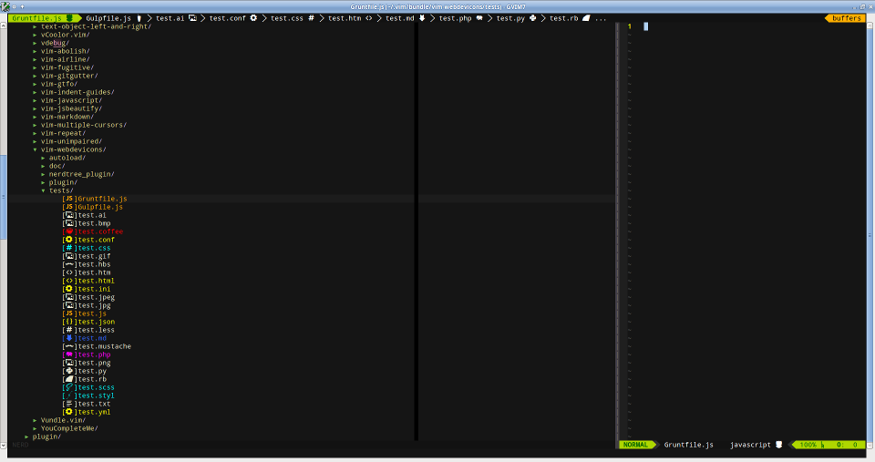

vim-webdevicons
=============

# Intro

After seeing the awesome theme for Atom (set-ui) and the awesome plugins work done for NERDTree and vim-airline and wanting something like this for Vim I decided to create my first plugin.

Adds a global config map of characters to file extensions (or entire filenames).

Works best with the patched font provided (see lib folder), install font and add to your .gvimrc, e.g.:
> set guifont=Droid\ Sans\ Mono\ for\ Powerline\ Plus\ Nerd\ File\ Types\ 11

# Screenshots

* NERDTree:

* Airline

>> statusline

>>> 

>> tabline

>>> 

# Features

# Configuration

# todo

* customize filetype icon colors
* more customization options in general
* more filetypes to support

# FAQ

@todo

# License

@todo